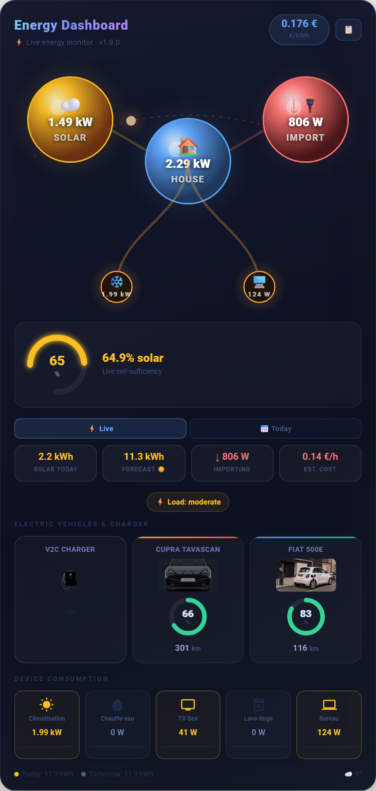

# Smooth Energy Card

[](https://hacs.xyz)
[](https://github.com/khrom06/Smooth-Energy-Card/releases)
[](LICENSE)

A beautiful, animated Home Assistant Lovelace card for visualizing your home energy in real-time.

## Features

- **Animated energy flow** — Real-time SVG with flowing particles showing solar → house → grid direction
- **Solar production** — Current power, today's yield, and solar forecast
- **Grid monitoring** — Bidirectional: tracks import and export (selling back to grid)
- **EV Charger (V2C / Wallbox)** — Live charging power, session cost (solar vs grid), animated cable
- **Multiple chargers** — `chargers[]` array supports any number of EVSE chargers
- **Electric vehicles** — Battery % ring gauge, range, ETA to target SoC, departure-time check
- **Smart plug devices** — Individual device consumption tiles with anomaly detection
- **Electricity cost** — Live cost estimate per hour, daily cost/savings summary, monthly budget tracker
- **Solar surplus** — Highlights available surplus power with green banner
- **Solar forecast** — Shows predicted production for today & tomorrow
- **EDF Tempo banner** — Color-coded daily tariff indicator (BLEU/BLANC/ROUGE)
- **Price alerts** — Price pill blinks red above a high threshold, turns green below a low threshold
- **Price forecast chart** — Next-12h tariff bars with cheapest 2-hour charge window chip
- **Self-sufficiency gauge** — Circular arc gauge showing % of consumption covered by solar
- **Battery/ESS** — Animated water-fill SoC + particles, charge/discharge arrows
- **V2G support** — Reverse particles + "Discharging to home" when EV exports to house
- **Grid outage banner** — Islanding detection via `grid_connected` binary_sensor
- **Smart charging recommendation** — Contextual advice: Tempo color, solar surplus, price level
- **EV optimizer & device scheduler** — Suggests best time to charge/run appliances based on tariff
- **Power chart** — Stacked area chart of live solar/grid/house power (180-sample buffer)
- **CO₂ savings banner** — Grams / kg of CO₂ avoided today, yearly estimate from savings log
- **Cumulative savings counter** — Total €€ saved via solar since card was installed
- **Yesterday comparison chips** — +/−% vs previous day for solar production & self-sufficiency
- **Personal records hall of fame** — All-time best solar day, sufficiency, export
- **In-card event log** — Timestamped log of export starts, solar peaks, grid outages (last 20)
- **Quick-action buttons** — Configurable pill buttons calling any HA service (scenes, switches, etc.)
- **Hide sections / Compact mode** — Hide any section by name, or `compact: true` for mobile/sidebar
- **WOW effects** — Aurora glow, grid shockwave, solar burst, export fireworks, thunderstorm SVG, battery water fill, time-of-day sky gradient, gossip idle lines, EV lightning storm, house heartbeat
- **Weather integration** — Solar orb shows current conditions; weather popup with hourly forecast
- **Fullscreen mode** — Full-screen toggle button in the header
- **Sparkline charts** — Mini 6-hour history charts in Solar Today and Grid stat tiles
- **Tap to more-info** — Tap any entity tile to open the HA entity popup
- **Light theme** — Clean light mode via `theme: light`
- **Multilingual** — English, French, Spanish, Chinese (Simplified), Japanese. Auto-detects HA language.

## Preview

<p align="center">
  
</p>

> Live card — solar production, animated energy flow, EV battery gauges, self-sufficiency arc, daily cost summary and smart charging recommendations.

## Installation

### Via HACS (Recommended)

1. Open **HACS** → **Frontend**
2. Click the **⋮ menu** → **Custom repositories**
3. Add `https://github.com/khrom06/Smooth-Energy-Card` as a **Lovelace** repository
4. Find **Smooth Energy Card** in the list and click **Download**
5. Reload your browser

### Manual installation

1. Download `smooth-energy-card.js` from the [latest release](https://github.com/khrom06/Smooth-Energy-Card/releases/latest)
2. Copy it to `config/www/community/smooth-energy-card/smooth-energy-card.js`
3. In Home Assistant: **Settings → Dashboards → Resources** → Add resource:
   - URL: `/local/community/smooth-energy-card/smooth-energy-card.js`
   - Type: **JavaScript Module**
4. Reload your browser

## Configuration

Add this to your Lovelace dashboard (YAML mode):

```yaml
type: custom:smooth-energy-card
title: Energy Dashboard

# ─── Power sensors ───────────────────────────────────────────
solar_power: sensor.your_solar_power          # Solar production (W or kW)
grid_power: sensor.your_grid_power            # Grid (negative = exporting)
house_power: sensor.your_house_power          # Total house consumption
v2c_power: sensor.your_v2c_power              # EV charger power (optional)

# ─── Electricity price ───────────────────────────────────────
kwh_price: sensor.your_kwh_price              # €/kWh current tariff
price_alert_high: 0.20                        # blink red above this
price_alert_low: 0.05                         # turn green below this
tariff_forecast: sensor.your_tariff_forecast  # next-12h price forecast (optional)

# ─── Solar energy stats ──────────────────────────────────────
solar_today: sensor.your_solar_today          # kWh produced today
solar_forecast_today: sensor.your_forecast_today
solar_forecast_tomorrow: sensor.your_forecast_tomorrow

# ─── Sun arc (optional, defaults to sun.sun entity or 06:00–21:00) ───
sunrise_hour: 6.5      # override sunrise hour if sun.sun not available
sunset_hour: 20.5      # override sunset hour

# ─── EDF Tempo / tariff alerts (optional) ────────────────────
tempo_color_today: sensor.your_tempo_today    # state: "BLEU", "BLANC", "ROUGE"
tempo_color_tomorrow: sensor.your_tempo_tomorrow

# ─── Daily cost summary (optional) ───────────────────────────
# IMPORTANT: these MUST be daily-reset sensors (utility_meter helpers), NOT cumulative totals
grid_energy_import: sensor.your_grid_import   # kWh imported today
grid_energy_export: sensor.your_grid_export   # kWh exported today
feed_in_rate: 0.1              # export revenue = export_kwh × price × feed_in_rate
monthly_budget: 150            # € — monthly cost cap, shows burn-rate bar (0 = disabled)

# ─── Grid connectivity (optional) ────────────────────────────
grid_connected: binary_sensor.your_grid_status  # off = grid outage banner shown
grid_demand_threshold: 3000    # W — alert threshold for peak demand (default: 3000)

# ─── Home Battery / ESS (optional) ───────────────────────────
battery_power: sensor.your_battery_power      # W or kW — positive=charging, negative=discharging
battery_soc: sensor.your_battery_soc          # % — battery state of charge
battery_rated_capacity: 10                    # kWh — enables battery health indicator

# ─── CO₂ intensity (optional) ────────────────────────────────
co2_intensity: sensor.your_co2_intensity      # g/kWh — defaults to 400 g/kWh if omitted

# ─── Weather (optional) ──────────────────────────────────────
weather_entity: weather.your_location         # weather condition icon on solar orb
weather_forecast_entity: weather.your_location  # for hourly forecast popup

# ─── EV Charger (V2C / Wallbox) ──────────────────────────────
v2c_image: /local/images/v2ctrydan-1.png
v2c_session_energy: sensor.v2c_session_energy

# ─── Multiple chargers (alternative to v2c_power) ────────────
chargers:
  - name: Wallbox 1
    power: sensor.wallbox_power               # W or kW
    image: /local/images/wallbox.png
    session_energy: sensor.wallbox_session

# ─── Electric vehicles (unlimited) ───────────────────────────
evs:
  - name: My EV
    battery: sensor.your_ev_battery           # %
    range: sensor.your_ev_range               # km
    image: /local/images/my_ev.png
    charging: binary_sensor.your_ev_charging  # optional
    charging_power: sensor.your_ev_charging_power  # kW — for ETA calc
    target_soc: sensor.your_ev_target_soc     # % — arc on gauge
    battery_capacity: 77                      # kWh
    departure_time: input_datetime.ev_departure  # HA entity with state "HH:MM" or "YYYY-MM-DD HH:MM:SS"

# ─── Individual device monitoring ────────────────────────────
devices_sort: true             # sort by live consumption (default: false)
devices:
  - name: Air Conditioning
    entity: sensor.your_ac_power
    icon: ac
    alert_above: 2000          # border pulses red above this wattage (optional)

# ─── Quick-action buttons ─────────────────────────────────────
quick_actions:
  - label: "EV Mode"
    icon: "⚡"
    service: scene.turn_on
    entity: scene.ev_charging_mode
  - label: "AC Off"
    icon: "❄️"
    service: switch.turn_off
    entity: switch.air_conditioning

# ─── Layout & display ────────────────────────────────────────
theme: dark                    # "dark" (default) or "light"
language: auto                 # "auto" | "en" | "fr" | "es" | "zh" | "ja"
compact: false                 # true = hide non-essential sections (ideal for mobile/sidebar)
hide:                          # hide individual sections by name (all shown by default)
  - forecast
  - eco_badges
  # Available: ev, devices, forecast, gauge, surplus, tempo, reco, budget,
  #            power_chart, price_chart, eco_badges, ev_optimizer, dev_scheduler,
  #            grid_alerts, savings, yday_chips, records, event_log, co2
```

> **Note:** The old flat `ev1_*` / `ev2_*` keys are still accepted and auto-migrated to the `evs[]` format on load.

## Configuration options

### Top-level keys

| Option | Type | Default | Description |
|--------|------|---------|-------------|
| `title` | string | `Energy Dashboard` | Card title |
| `solar_power` | entity | — | Solar production sensor (W or kW) |
| `grid_power` | entity | — | Grid power — **negative = exporting** |
| `house_power` | entity | — | Total house consumption (W or kW) |
| `v2c_power` | entity | — | EV charger power (W or kW) |
| `kwh_price` | entity | — | Current electricity price (€/kWh) |
| `solar_today` | entity | — | Energy produced today (kWh) |
| `solar_forecast_today` | entity | — | Predicted solar production today (kWh) |
| `solar_forecast_tomorrow` | entity | — | Predicted solar production tomorrow (kWh) |
| `v2c_image` | string | — | Image URL for V2C charger |
| `v2c_session_energy` | entity | — | Charged this session (kWh) |
| `tempo_color_today` | entity | — | EDF Tempo color — state: `BLEU`/`BLANC`/`ROUGE` |
| `tempo_color_tomorrow` | entity | — | EDF Tempo color tomorrow |
| `grid_energy_import` | entity | — | Grid imported today (kWh) — **must be a daily-reset sensor** |
| `grid_energy_export` | entity | — | Grid exported today (kWh) — **must be a daily-reset sensor** |
| `feed_in_rate` | number | `0` | Feed-in ratio (e.g. `0.1` = 10% of import price) |
| `monthly_budget` | number | `0` | Monthly € cap — shows burn-rate bar (`0` = disabled) |
| `grid_connected` | entity | — | Binary sensor: `off` = grid offline → islanding banner |
| `grid_demand_threshold` | number | `3000` | W — peak demand alert threshold |
| `price_alert_high` | number | — | Price pill blinks red above this (€/kWh) |
| `price_alert_low` | number | — | Price pill turns green below this (€/kWh) |
| `tariff_forecast` | entity | — | Sensor with tariff forecast data (`raw_today`/`prices` attribute) |
| `battery_power` | entity | — | Battery/ESS power — **positive = charging, negative = discharging** |
| `battery_soc` | entity | — | Battery state of charge (%) |
| `battery_rated_capacity` | number | `0` | Battery kWh capacity — enables health indicator |
| `battery_cycles` | sensor | — | Battery charge cycle count — used for SoH estimation |
| `battery_purchase_date` | string | — | Battery purchase date (YYYY-MM-DD) — used for SoH estimation |
| `co2_intensity` | entity | — | Grid CO₂ intensity (g/kWh); defaults to 400 g/kWh |
| `co2_grid_intensity` | sensor | — | Live grid CO₂ intensity (gCO₂/kWh) — shows green/amber/red badge |
| `heat_pump_power` | sensor | — | Heat pump power (W or kW) — shown as SVG node |
| `diverter_power` | sensor | — | Solar diverter power (W or kW) |
| `diverter_today_kwh` | sensor | — | Solar diverter daily kWh |
| `weather_entity` | entity | — | Weather entity for condition icon on solar orb |
| `weather_forecast_entity` | entity | — | Weather entity for hourly forecast popup |
| `sunrise_hour` | number | `6` | Override sunrise hour if `sun.sun` is unavailable |
| `sunset_hour` | number | `21` | Override sunset hour if `sun.sun` is unavailable |
| `theme` | string | `dark` | `dark` or `light` |
| `language` | string | `auto` | `auto`, `en`, `fr`, `es`, `zh`, `ja` |
| `compact` | boolean | `false` | Auto-hide non-essential sections (devices, forecast, charts) |
| `hide` | list | `[]` | Hide individual sections by ID (see list in example above) |
| `quick_actions` | list | `[]` | Configurable action pill buttons (see below) |
| `devices_sort` | boolean | `false` | Sort device tiles by live consumption |
| `chargers` | list | `[]` | Additional EV chargers (see below) |
| `evs` | list | `[]` | Electric vehicles (see below) |
| `devices` | list | `[]` | Device monitors (see below) |

### Quick actions (`quick_actions[]`)

```yaml
quick_actions:
  - label: "Night Mode"    # button label
    icon: "🌙"             # emoji icon
    service: scene.turn_on # HA service: domain.service
    entity: scene.night    # entity_id to pass as service target
    data:                  # optional extra service data
      transition: 2
```

### Charger entry (`chargers[]`)

| Field | Type | Description |
|-------|------|-------------|
| `name` | string | Display name |
| `power` | entity | Power sensor (W or kW) |
| `image` | string | Image URL (optional) |
| `session_energy` | entity | Session energy sensor (kWh, optional) |

### EV entry (`evs[]`)

| Field | Type | Description |
|-------|------|-------------|
| `name` | string | Display name |
| `battery` | entity | Battery level (%) |
| `range` | entity | Estimated range (km) |
| `image` | string | Image URL (optional) |
| `charging` | entity | Binary sensor — `on` when charging (optional) |
| `charging_power` | entity | Charging power (kW) — for ETA |
| `charging_rate` | entity | Charging rate (%/h) — alternative to `charging_power` |
| `target_soc` | entity | Target SoC (%) — shows arc on gauge |
| `battery_capacity` | number | kWh — required for ETA via `charging_power` |
| `departure_time` | entity | HA entity whose state contains `HH:MM` — shows departure check (✓ green / ⚠️ red pulsing) |

### Device configuration

```yaml
devices:
  - name: My Device
    entity: sensor.xxx    # Power sensor (W or kW)
    icon: plug            # ac | water | tv | washer | computer | server | plug | bolt | car | home
    alert_above: 2000     # Optional — border pulses red above this wattage
```

## Grid power convention

The card assumes that **negative grid power = selling to grid** (net metering convention).
This matches Shelly EM in standard configuration. If your setup uses the opposite convention, invert your sensor value in a Home Assistant template sensor.

## Supported sensor units

- Power sensors: `W` or `kW` (auto-detected via `unit_of_measurement`)
- Energy sensors: `kWh`
- Price: `€/kWh`
- Battery: `%`
- Range: `km`

## Changelog

### v2.5.0
- **EV Solar Charge Planner**: reads your solar forecast sensor's hourly data, finds the best free-solar charging window, and shows per-EV cost breakdown (kWh free vs grid). Mini bar chart shows hourly surplus forecast.
- **Fix**: Personal Records and Event Log panels no longer auto-collapse on HA state updates.

### v2.4.0 (2026-03-16)
- **Fix:** Personal Records, Event Log and Weekly Heatmap `<details>` panels no longer collapse on every HA state update — `_patch()` now preserves `open` state before innerHTML replacement
- **EV grid-only cost:** session cost estimate subtracts live solar contribution — shows "☀️ FREE" when >95% solar-powered
- **CO₂ intensity badge:** green/amber/red gCO₂/kWh badge from `co2_grid_intensity` sensor (Electricity Maps, etc.)
- **Heat pump / diverter SVG node:** optional energy flow node at bottom-right for `heat_pump_power` or `diverter_power`
- **Earned revenue ticker:** pulsing live €/h display during active solar export
- **Solcast hourly overlay:** reads hourly forecast attributes from forecast sensor
- **Battery State-of-Health estimator:** capacity fade tracker from `battery_cycles` + `battery_purchase_date`
- **Export streak counter:** consecutive days with net export; personal best in localStorage
- **Weekly demand heatmap:** 7×24h colour tile grid of hourly consumption patterns
- **Solar divert tracker:** daily kWh to hot water / heat pump from `diverter_today_kwh` sensor
- **Grid outage banner:** battery runway countdown added
- **Monthly budget:** month-end projected bill added
- New config: `co2_grid_intensity`, `heat_pump_power`, `diverter_power`, `diverter_today_kwh`, `battery_cycles`, `battery_purchase_date`

### v2.3.1 (2026-03-16)
- Fix: added `hide`, `compact`, `quick_actions`, `monthly_budget`, `grid_connected`, `sunrise_hour`, `sunset_hour` to `_defaultConfig()` (these config keys were silently ignored before)
- Fix: added `total_saved` translation key to all 5 languages (was showing English fallback in all locales)
- Updated README with full config reference for all keys introduced since v2.0.0

### v2.3.0 (2026-03-16)
- **Bug fix:** Sun arc now reads `sun.sun` entity (`next_rising`, `next_setting`, `elevation`) for accurate local sunrise/sunset times worldwide; falls back to `sunrise_hour`/`sunset_hour` config keys, then to 06:00–21:00
- **Hide sections:** `hide: [list]` config — hide any card section by name; 19 section IDs supported
- **Compact mode:** `compact: true` auto-hides non-essential sections (devices, forecast, charts) for mobile/sidebar use; adds `card-compact` CSS class
- **Savings counter:** Cumulative total €€ saved via solar — persisted daily in `localStorage('sec-savings-log')`; shows "☀️ Total saved: €XXX over N months"
- **Quick-action buttons:** `quick_actions[]` config — configurable pill buttons calling any HA service; tap animation feedback
- **Yesterday comparison chips:** +/−% delta vs previous day for solar production & self-sufficiency (stored in `sec-daily-log`)
- **Personal records hall of fame:** Collapsible panel tracking all-time best solar day, sufficiency %, and peak export (stored in `sec-records`)
- **In-card event log:** Ring buffer (20 events) with timestamped entries for export-start, solar peak, and grid outage events
- **CO₂ savings banner:** Grams/kg of CO₂ avoided today + yearly estimate from savings log
- **Price forecast cheapest window:** "🔌 Optimal charge: HH:00–HH:00 · avg €X.XXX/kWh" chip shown below price chart

### v2.2.0 (2026-03-16)
- **WOW:** Thunderstorm SVG on high grid import (storm cloud + rain lines + lightning bolt in flow diagram)
- **WOW:** Battery water fill — animated sinusoidal wave inside battery circle, fill height = SoC%
- **WOW:** Node gossip lines — all idle nodes linked by dashed animated lines during zero-flow state
- **WOW:** Sky gradient — card background shifts through dawn/day/dusk/night colors by time of day
- **WOW:** Export fireworks — celebratory SVG rings + particles on new daily export record (localStorage)
- **WOW:** EV warp speed — EV card `::before` pseudo-element warps when charging (CSS animation)
- **Feature:** Grid outage banner — amber islanding alert when `grid_connected` binary sensor is off
- **Feature:** Monthly budget tracker — burn-rate bar with projected end-of-month cost
- **Feature:** Device anomaly detection — Welford's online algorithm per device/per hour; orange dot badge on anomalous tiles
- **Feature:** Stacked area power chart — 180-sample circular buffer; live solar/grid/house polylines

### v2.1.0 (2026-03-16)
- **WOW:** Aurora glow — card box-shadow pulses through green/blue/purple when self-sufficiency ≥ 80%
- **WOW:** Grid shockwave — 3 expanding SVG rings on import→export transition
- **Feature:** Departure ETA — per-EV `departure_time` entity; green ✓ or red ⚠️ depending on whether charge ETA fits
- **Bug fix:** Charging cost fallback — EV #1 shows correct cost when no `charging:` sensor is configured

### v2.0.0 (2026-03-16)
- **WOW:** House heartbeat ring — pulsing SVG ring around house orb scaled to total consumption
- **WOW:** EV lightning storm — ⚡ flashing icon on EV card border when charging
- **Feature:** V2C charger as SVG node — charger appears as animated node in the energy flow diagram
- **Feature:** Multiple chargers — `chargers[]` array replaces single `v2c_power` (backward-compatible)
- **Feature:** EV optimizer — suggests best charge time based on current tariff
- **Feature:** Device scheduler — suggests best time to run heavy appliances

### v1.9.x (2026-03-15)
- Batch 1 & 2 WOW effects: particle pulse, battery shimmer, solar burst, night mode, sparklines in orbs, gradient flows, charging ETA ring, grid stress indicator
- Fullscreen mode, orb detail panel, weather integration, CO₂ tracking, eco-badges
- Charger SVG node and V2G reverse-flow particles

### v1.6.0 (2026-03-15)
- Full internationalization (i18n): English, French, Spanish, Chinese (Simplified), Japanese
- Auto-detects HA language; manual override via `language` config key

### v1.0.0–v1.5.4 (2026-03-15)
- Initial release through V2G support, Tempo banner, daily cost summary, sparklines, self-sufficiency gauge, smart charging recommendations, sun arc, glassmorphism UI

## Contributing

Pull requests welcome! Please open an issue first to discuss major changes.

## License

MIT © 2026

---

*Built with ❤️ for Home Assistant*
